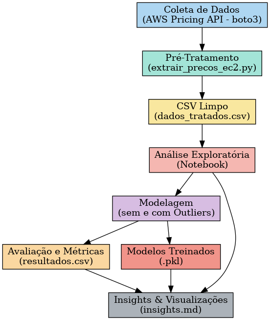

# 📄 Documentação do Fluxo e Reuso – AWS EC2 Pricing Pipeline

## 📌 1. Visão Geral
Este projeto implementa um **pipeline híbrido** para coleta, tratamento, análise e modelagem de preços de instâncias EC2 utilizando a **AWS Pricing API**.  
O fluxo separa a etapa de **ingestão pré-tratada** (script Python) da **análise exploratória e modelagem** (notebook), garantindo **reprodutibilidade, flexibilidade e escalabilidade**.

📊 **Diagrama do Fluxo:**


---

## 📌 2. Pré-requisitos

### **Bibliotecas Python**
```bash
pip install boto3 pandas matplotlib seaborn joblib graphviz scikit-learn
```

### **Credenciais AWS**
Configurar com:
```bash
aws configure
```
Ou exportar variáveis de ambiente:
```bash
export AWS_ACCESS_KEY_ID=SEU_ACCESS_KEY
export AWS_SECRET_ACCESS_KEY=SEU_SECRET_KEY
export AWS_DEFAULT_REGION=us-east-1
```

### **Estrutura de Pastas**
```
data/        # Armazena CSVs de dados
diagramas/   # Diagramas e imagens do fluxo
modelos/     # Modelos treinados (.pkl)
notebooks/   # Notebooks de análise
```

---

## 📌 3. Execução do Pipeline

### **Etapa 1 – Coleta de Dados**
- Script: `extrair_precos_ec2.py`
- Função: consultar a AWS Pricing API para instâncias EC2 (Linux/Shared) e gerar `custos_aws_ec2_on_demand.csv`.
- Comando:
```bash
python extrair_precos_ec2.py
```

### **Etapa 2 – Análise Exploratória**
- Notebook: `notebooks/analise_precos_ec2.ipynb`
- Passos:
  1. Carregar `custos_aws_ec2_on_demand.csv`.
  2. Criar métricas adicionais (EX: `price_per_vcpu`, `price_per_gb`).
  3. Gerar visualizações e insights.

### **Etapa 3 – Modelagem**
- Função de treino: `treinar_avaliar(df, nome_modelo)`
- Cenários:
  - **Modelo sem Outliers** → foco em instâncias de uso comum.
  - **Modelo com Outliers** → inclui instâncias especializadas.
- Salvando modelos:
```python
import joblib
joblib.dump(modelo_normal, "modelos/modelo_normal.pkl")
joblib.dump(modelo_outlier, "modelos/modelo_outlier.pkl")
```

### **Etapa 4 – Salvando Resultados**
- Métricas:
```python
salvar_metricas(met_normal, met_outlier, path="data/resultados.csv")
```
- Insights:
  - Salvar em `insights.md` para documentar achados.

---

## 📌 4. Parâmetros e Configuração
- **ServiceCode**: `"AmazonEC2"`
- **Filtros**:
  - `operatingSystem = Linux`
  - `tenancy = Shared`
  - `preInstalledSw = NA`
  - `capacitystatus = Used`
- **Regiões AWS**: configuradas no argumento `--regions` no script de coleta.
- **Paginação**: `max_pages` define o número máximo de páginas coletadas.

---

## 📌 5. Reuso do Pipeline

### Alterar Serviço AWS
Basta mudar `ServiceCode` no script:
```python
"ServiceCode": "AmazonRDS"  # Exemplo para RDS
```

### Alterar Filtros
Modificar lista `base_filters` para ajustar o tipo de instância desejado (ex.: GPU, Windows).

### Reutilizar Modelo Treinado
```python
import joblib
modelo = joblib.load("modelos/modelo_normal.pkl")
y_pred = modelo.predict(novos_dados)
```

---

## 📌 6. Próximos Passos
- **Automatização**:
  - AWS Lambda + EventBridge para rodar em horários definidos.
  - Cronjob em servidor/VPS.
- **Persistência**:
  - Salvar dados em banco (PostgreSQL, DynamoDB) para histórico.
- **Visualização**:
  - Criar dashboard (Power BI, Grafana, Streamlit).
- **Modelos Avançados**:
  - Utilizar **XGBoost** para tratar outliers de forma robusta.
  - Criar modelos separados para **uso comum** e **instâncias de nicho**.

---

## 📌 7. Contato
Para dúvidas ou melhorias, entre em contato com o autor do projeto.